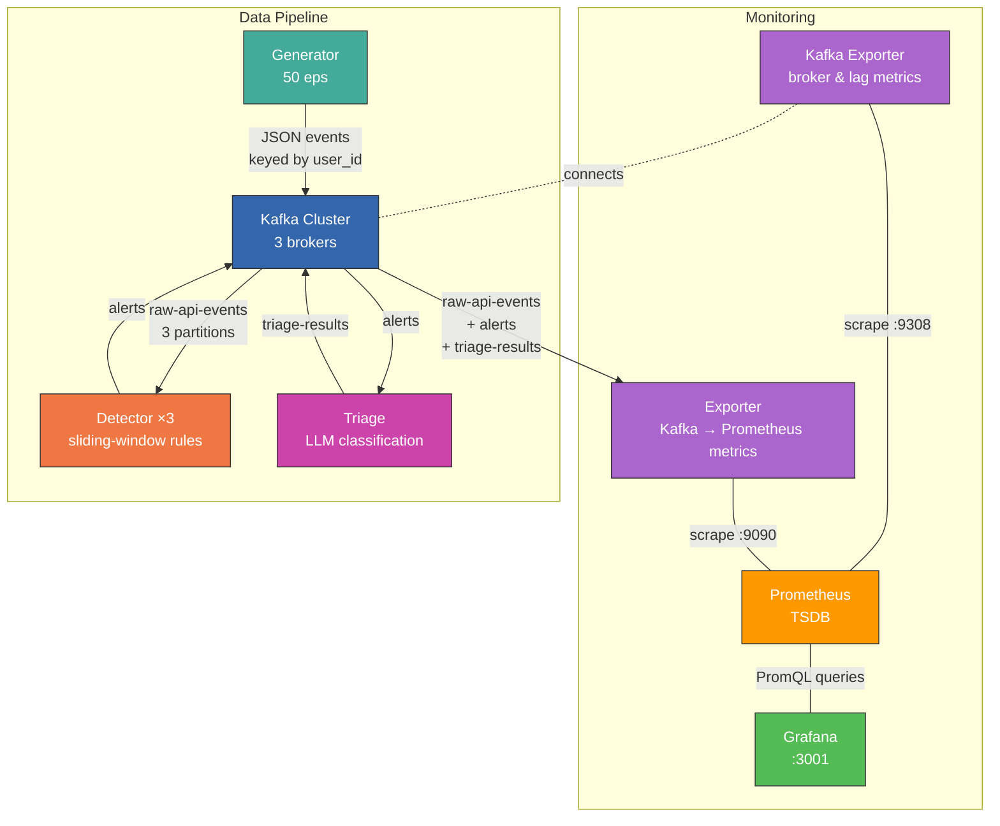
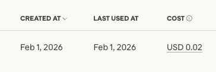

# DR Platform

Real-time Claude API abuse detection platform — streaming telemetry through Kafka into a rule-based detection engine with LLM-powered triage.

[Anthropic's RSA 2025 talk](https://www.youtube.com/watch?v=JRvQGRqMazA) on using LLMs to power SOC operations got me thinking about what that pipeline actually looks like end-to-end. This is a prototype: a complete detection-and-triage system that streams simulated Claude API telemetry through Kafka, runs sliding-window detection rules, and lets an LLM classify alerts into response tiers. It covers the full loop from event generation to analyst-ready triage output.

## Architecture



Data flows through three Kafka topics, each representing a stage in the SOC pipeline:

| Stage | Kafka Topic | What happens |
|-------|-------------|--------------|
| **Telemetry** | `raw-api-events` | Simulated Claude API traffic at ~50 eps — request metadata, token counts, latency, safety flags. Events are keyed by `user_id` so each user's activity lands on the same partition. |
| **Detection** | `alerts` | Three detector replicas run sliding-window rules over the event stream. Threshold crossings produce alerts with severity and rule-specific evidence. |
| **Triage** | `triage-results` | Each alert is classified — by an LLM or a deterministic mock — into a verdict (true positive / false positive / needs investigation), a risk score (1-10), and a response tier (P1 / P2 / P3). |

## Project structure

```
dr_platform/
├── generator/              # Simulated Claude API telemetry producer
│   └── main.py
├── detector/               # Sliding-window detection engine
│   ├── engine.py           # Rule evaluator (no Kafka dependency)
│   ├── sliding_window.py   # Deque-based per-key windowing
│   ├── rules/
│   │   ├── rate_abuse.py
│   │   ├── prompt_injection.py
│   │   └── token_abuse.py
│   └── tests/
├── triage/                 # LLM-powered alert classification
│   ├── main.py             # Kafka consumer + Claude API / mock fallback
│   ├── prompt.py           # System & user prompt construction
│   ├── mock.py             # Deterministic triage (no API key needed)
│   └── tests/
├── exporter/               # Kafka → Prometheus metrics bridge
│   └── main.py
├── monitoring/
│   ├── prometheus.yml
│   └── grafana/
│       ├── dashboards/     # 3 pre-built dashboards (JSON)
│       └── provisioning/   # Auto-wired datasource + dashboard config
├── docker/
│   ├── Dockerfile
│   └── docker-compose.yml  # Full stack: 15 containers
├── secrets/                # API key mount point (gitignored)
├── setup.sh
├── pyproject.toml
└── requirements.txt
```

## Detection rules

Rules are Python classes, not YAML. Each one defines a `match()` filter, a `trigger()` threshold, and an `evidence()` summary — tested with pytest, reviewed via PR, deployed as code.

| Rule | Detects | Window | Threshold | Severity | ATT&CK |
|------|---------|--------|-----------|----------|--------|
| `rate_abuse` | Automated scraping, credential-stuffing proxies, runaway retry loops | 60s sliding | >60 combined API requests and rate-limit events | high | T1190 |
| `prompt_injection` | Deliberate adversarial probing — iterating payloads to bypass safety | 5min sliding | >3 safety triggers | critical | T1059.006 |
| `token_abuse` | Denial-of-wallet attacks — near-max context with zero caching | 15min sliding | avg >150K input tokens AND <5% cache rate (min 5 events) | high | — |

Example rule (`rate_abuse.py`):

```python
class RateAbuse(Rule):
    id = "rate_abuse"
    name = "API Rate Abuse"
    severity = "high"
    window_seconds = 60

    def match(self, event):
        return event["event_type"] in ("api_request", "rate_limit_event")

    def trigger(self, events):
        return len(events) > 60

    def evidence(self, events):
        api_reqs = sum(1 for e in events if e.get("event_type") == "api_request")
        rate_limits = sum(1 for e in events if e.get("event_type") == "rate_limit_event")
        timestamps = [e.get("timestamp", 0) for e in events]
        span = max(timestamps) - min(timestamps) if len(timestamps) > 1 else 1
        return {
            "api_request_count": api_reqs,
            "rate_limit_count": rate_limits,
            "events_per_second": round(len(events) / max(span, 1), 2),
        }
```

## LLM triage

The triage service classifies each alert into a response priority, following the P1-P3 model standard in SOC operations:

| Priority | Label | Action | Example |
|----------|-------|--------|---------|
| **P1** | `gold` | Page on-call, block user, preserve evidence | Prompt injection cluster |
| **P2** | `silver` | Investigation queue, assign to analyst | Rate abuse from unknown user |
| **P3** | `bronze` | Auto-acknowledge, log only | Borderline threshold hit |

**Mock mode (default)** runs out of the box with no API key — deterministic classification that still produces realistic Grafana metrics.

**Real Claude triage:**

1. Create or grab your API key from the [Anthropic Console](https://platform.claude.com/settings/keys), then write it to the secrets file (gitignored):
   ```bash
   echo "sk-ant-..." > secrets/anthropic_api_key
   ```
2. Remove `--mock` from the triage command in `docker/docker-compose.yml`
3. Restart:
   ```bash
   docker compose -f docker/docker-compose.yml up -d --build
   ```

The model defaults to `claude-haiku-4-5-20251001`. To change it, set `ANTHROPIC_MODEL` before starting:

```bash
export ANTHROPIC_MODEL=claude-sonnet-4-5-20250929
docker compose -f docker/docker-compose.yml up -d --build
```

**Cost warning:** At 50 eps the generator produces a steady stream of alerts. With real triage (especially Opus), credits burn fast. Lower `--eps` to 5-10 in `docker-compose.yml` when using a real API key.

**Verifying the pipeline is talking to the model:** check your key in the [Anthropic Console](https://platform.claude.com/settings/keys). The "Last Used At" timestamp updating and the cost incrementing are the clearest indicators that real triage calls are hitting the API.



The API key is mounted via Docker Compose secrets at `/run/secrets/anthropic_api_key` — it never appears in `docker inspect`, env dumps, or process listings.

## Design decisions

**Kafka over SQS/Redis Streams.** Three decoupled stages (telemetry, detection, triage) need independent scaling, replay capability, and inspectability. Kafka gives all three: consumer groups let each stage scale horizontally, topic retention allows replaying from any offset, and Kafka UI makes every message inspectable without custom tooling. SQS would delete messages after read; Redis Streams lacks native partitioning.

**Sliding windows over tumbling windows.** Rate abuse happens continuously, not in neat time buckets. A tumbling window can miss an attack that straddles a boundary — 30 requests in the last half of window N and 31 in the first half of N+1 would stay under threshold in both windows. Sliding windows catch this by evaluating the full trailing duration on every event. The tradeoff is state: each (rule, user) pair holds a deque. In production this moves to Redis sorted sets; in-memory is fine for a single-process prototype.

**`user_id` as the Kafka message key.** All events for a given user land on the same partition, which means the same detector replica. This guarantees per-user sliding windows are consistent without cross-replica coordination. It also means triage decisions for a user are ordered, and Grafana's "top users by alert count" panel works without a global aggregation layer. The tradeoff: this only works for per-user rules. Cross-user detection (e.g., multiple accounts in the same org coordinating an attack, or distributed abuse from distinct user IDs hitting the same endpoint pattern) would require a global aggregation layer.

**Python classes over YAML for rules.** YAML detection rules inevitably grow into a bespoke DSL as rule complexity increases (conditional logic, field aggregations, cross-event correlation). Panther Labs went through exactly this migration — YAML to YAML+Python to all-Python. Python classes give full expressiveness, pytest testability, IDE support, and inheritance from the start. Each rule is its own file, so detection-as-code workflows (PR per rule, git blame, CI gating) work with zero custom tooling.

**Mock-first triage.** The system runs end-to-end with no API key. Mock mode uses deterministic severity-based classification that still produces realistic tier distributions for Grafana dashboards. This means anyone can clone, `docker compose up`, and see the full pipeline working — then swap in a real API key to see LLM triage without changing architecture.

## Quick start

```bash
# One-time setup (venv, system deps, Docker images)
chmod +x setup.sh && ./setup.sh

# Start the full stack (15 containers)
docker compose -f docker/docker-compose.yml up -d --build
```

## What happens

The generator produces ~50 events/sec with a mix of normal users and three attacker profiles. The detector picks these up and fires alerts as abuse thresholds are crossed. Rate abuse fires first (~60s), then prompt injection (~minutes), then token abuse (~15min).

**Watch alerts fire:**

```bash
docker compose -f docker/docker-compose.yml logs -f detector 2>&1 | grep ALERT
```

```
ALERT  rule=rate_abuse           severity=high     user=user_0009  events=62
ALERT  rule=prompt_injection     severity=critical  user=user_0010  events=5
ALERT  rule=token_abuse          severity=high     user=user_0011  events=6
```

**Watch triage classify them:**

```bash
docker compose -f docker/docker-compose.yml logs -f triage
```

```
TRIAGE [GOLD  ]  rule=prompt_injection    user=user_0010   verdict=true_positive       confidence=high     risk=9
TRIAGE [GOLD  ]  rule=rate_abuse          user=user_0009   verdict=true_positive       confidence=medium   risk=7
TRIAGE [SILVER]  rule=token_abuse         user=user_0011   verdict=needs_investigation confidence=medium   risk=5
```

**Inspect raw Kafka topics:** open Kafka UI at [http://localhost:8080](http://localhost:8080) — check `raw-api-events`, `alerts`, and `triage-results`.

## Dashboards

Open Grafana at [http://localhost:3001](http://localhost:3001) (no login required) → **Dashboards → Detection & Response**.

### Infrastructure Health — "Is the pipeline working?"

| Panel | What to look for |
|-------|-----------------|
| Pipeline Throughput | Should hover around ~50 eps. Drops to 0 = pipeline is broken. |
| Kafka Brokers | Must be 3. Fewer = degraded replication. |
| Detector / Exporter Lag | Unprocessed messages. Should stay <100. Rising = can't keep up. |
| LLM Success Rate | % of triage decisions from the real LLM. <100% in LLM mode = fallbacks happening. |
| Triage Model Split | Donut chart — LLM vs mock. In LLM mode, mock slice = degraded triage. |
| Kafka Topic Throughput | msgs/sec by topic. `alerts` should be <<1% of `raw-api-events`. |
| Consumer Lag by Partition | Even distribution = healthy. One partition lagging = that replica is sick. |
| Simulated API Response Latency | p50/p95/p99 of simulated Claude API latency from the generator (not internal pipeline latency). p99 spiking while p50 stays flat = large-context outliers. |
| Data Volume (tokens/sec) | Input spiking with near-zero cache = token stuffing. |

### Detection & Threat Analysis — "Who's being bad?"

| Panel | What to look for |
|-------|-----------------|
| Alert Rate / Critical / High / Unique Offenders | Top-line stats. Baseline ~2-5 alerts/min. |
| Alert Rate by Rule | Which rules are firing. Same user triggering multiple rules = coordinated multi-vector abuse. |
| Safety Trigger Rate by Type | Upstream signal. Rising triggers without alerts = thresholds too high. |
| Top Users by Alert Count | The usual suspects. Cross-reference with event volume to distinguish abusers from power users. |
| Top Users by Event Volume | High volume + no alerts = normal. High volume + alerts = confirmed abuse. |
| Rate Limit / Request Ratio | Leading indicator. Normal <1%, active abuse >5%. |
| Input Token Distribution | Heatmap. Normal users cluster at 100-8K tokens. Token abusers form a distinct band at 150K+. |

### Triage & Response — "Is the SOC automation working?"

| Panel | What to look for |
|-------|-----------------|
| Gold Escalations (5min) | P1 immediate-action alerts. The metric that matters most in a real SOC. |
| Triage Rate | Should match alert rate. A gap = triage is falling behind. |
| True Positive Rate | >70% = rules are good. <30% = too many false positives, rules need tuning. |
| Median Risk Score | Trending up = threat severity increasing. |
| Tier Distribution | Healthy: ~60% P3 / 30% P2 / 10% P1. |
| Triage Rate by Tier | P1 spikes = active incidents. Sustained P2 = emerging threats. P3 = noise floor. |

Every panel has an `i` tooltip with more detail.

## Limitations and next steps*

This is a working prototype, not production software. The following are the immediate next steps that would move the needle toward a real system:

**Structured LLM output.** The triage service currently relies on prompt instructions to coerce the LLM into returning a specific JSON schema, with a fallback to mock if parsing fails. A valid JSON response with wrong field names or types passes through silently. The fix is [Anthropic tool use](https://docs.anthropic.com/en/docs/build-with-claude/tool-use) — define the triage schema as a tool's `input_schema` and force it via `tool_choice`, so the API enforces structure at generation time.

**Schema registry for Kafka.** Events, alerts, and triage results are plain JSON with no contract enforcement. A producer can ship a breaking schema change and the downstream consumer finds out at runtime. Confluent Schema Registry with Protobuf or Avro schemas would catch this at produce time, enable schema evolution (adding fields without breaking consumers), and give Kafka UI automatic deserialization.

**Stateless detection with external state.** Sliding windows are in-memory deques — if a detector replica restarts, all accumulated window state is lost. Moving window state to Redis sorted sets (keyed by `rule:user_id`, scored by timestamp) makes detectors stateless and horizontally scalable without partition affinity requirements.

**Enrichment layer between detection and triage.** The triage LLM currently receives only the evidence the detector computed from its window. A production system would enrich alerts with external context before triage: user history (first seen, past alerts, account age), threat intel (IP reputation, known attack patterns), and asset inventory (org tier, rate limit plan). This context meaningfully changes triage decisions. Normalizing events and alerts into [OCSF](https://schema.ocsf.io/) (Open Cybersecurity Schema Framework) would also make the enrichment step composable — every upstream source and downstream consumer agrees on field names, types, and semantics instead of ad-hoc JSON key conventions.

**Backpressure and dead-letter handling.** If the LLM API is slow or down, the triage consumer falls behind with no mechanism to shed load or park unprocessable messages. A dead-letter topic for failed triage attempts, combined with consumer lag alerting that already exists in Grafana, would close this gap.

_*These are the immediate priorities, not an exhaustive list._

## Tests

```bash
source .venv/bin/activate
pytest detector/tests/ triage/tests/ -v
```

## Stop

```bash
docker compose -f docker/docker-compose.yml down
```

Add `-v` to wipe Kafka/ZooKeeper data for a clean restart.
