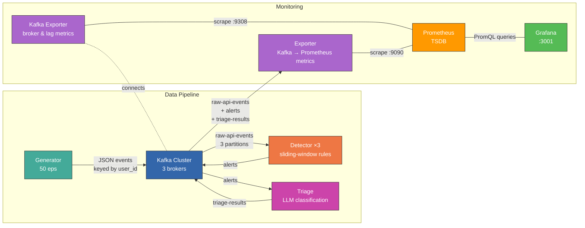

# DR Platform

Real-time Claude API abuse detection platform — streaming telemetry through Kafka into a rule-based detection engine.

Anthropic's RSA 2025 talk on using LLMs to power SOC operations got me thinking about what that pipeline actually looks like end-to-end. I like building prototypes in my spare time to pressure-test ideas, so I put this together: a small but complete detection-and-triage system that streams simulated Claude API telemetry through Kafka, runs sliding-window detection rules, and lets an LLM classify the alerts into response tiers. It's a weekend project, not production software, but it covers the full loop from event generation to analyst-ready triage output.

## Architecture



Events are keyed by `user_id`, so a user's events always land on the same Kafka partition — keeping per-user sliding windows consistent across the 3 detector replicas.

## Quick start

```bash
# One-time setup (venv, system deps, Docker images)
chmod +x setup.sh && ./setup.sh

# Start the full stack (15 containers)
docker compose -f docker/docker-compose.yml up -d --build
```

## What happens

The generator produces ~50 events/sec with a mix of normal users and three attacker profiles. The detector picks these up and fires alerts as abuse thresholds are crossed. Rate abuse fires first (~60s), then prompt injection (~minutes), then token abuse (~15min).

**Watch alerts fire:**

```bash
docker compose -f docker/docker-compose.yml logs -f detector 2>&1 | grep ALERT
```

```
ALERT  rule=rate_abuse           severity=high     user=user_0009  events=62
ALERT  rule=prompt_injection     severity=critical  user=user_0010  events=5
ALERT  rule=token_abuse          severity=high     user=user_0011  events=6
```

**Watch triage classify them:**

```bash
docker compose -f docker/docker-compose.yml logs -f triage
```

```
TRIAGE [GOLD  ]  rule=prompt_injection    user=user_0010   verdict=true_positive       confidence=high     risk=9
TRIAGE [GOLD  ]  rule=rate_abuse          user=user_0009   verdict=true_positive       confidence=medium   risk=7
TRIAGE [SILVER]  rule=token_abuse         user=user_0011   verdict=needs_investigation confidence=medium   risk=5
```

**Inspect raw Kafka topics:** open Kafka UI at [http://localhost:8080](http://localhost:8080) — check `raw-api-events`, `alerts`, and `triage-results`.

## Dashboards

Open Grafana at [http://localhost:3001](http://localhost:3001) (no login required) → **Dashboards → Detection & Response**.

### Infrastructure Health — "Is the pipeline working?"

| Panel | What to look for |
|-------|-----------------|
| Pipeline Throughput | Should hover around ~50 eps. Drops to 0 = pipeline is broken. |
| Kafka Brokers | Must be 3. Fewer = degraded replication. |
| Detector / Exporter Lag | Unprocessed messages. Should stay <100. Rising = can't keep up. |
| Kafka Topic Throughput | msgs/sec by topic. `alerts` should be <<1% of `raw-api-events`. |
| Consumer Lag by Partition | Even distribution = healthy. One partition lagging = that replica is sick. |
| Simulated API Response Latency | p50/p95/p99 of simulated Claude API latency from the generator (not internal pipeline latency). p99 spiking while p50 stays flat = large-context outliers. |
| Data Volume (tokens/sec) | Input spiking with near-zero cache = token stuffing. |

### Detection & Threat Analysis — "Who's being bad?"

| Panel | What to look for |
|-------|-----------------|
| Alert Rate / Critical / High / Unique Offenders | Top-line stats. Baseline ~2-5 alerts/min. |
| Alert Rate by Rule | Which rules are firing. Same user triggering multiple rules = coordinated multi-vector abuse. |
| Safety Trigger Rate by Type | Upstream signal. Rising triggers without alerts = thresholds too high. |
| Top Users by Alert Count | The usual suspects. Cross-reference with event volume to distinguish abusers from power users. |
| Top Users by Event Volume | High volume + no alerts = normal. High volume + alerts = confirmed abuse. |
| Rate Limit / Request Ratio | Leading indicator. Normal <1%, active abuse >5%. |
| Input Token Distribution | Heatmap. Normal users cluster at 100-8K tokens. Token abusers form a distinct band at 150K+. |

### Triage & Response — "Is the SOC automation working?"

| Panel | What to look for |
|-------|-----------------|
| Gold Escalations (5min) | Immediate-action alerts. The metric that matters most in a real SOC. |
| Triage Rate | Should match alert rate. A gap = triage is falling behind. |
| True Positive Rate | >70% = rules are good. <30% = too many false positives, rules need tuning. |
| Median Risk Score | Trending up = threat severity increasing. |
| Tier Distribution | Healthy: ~60% Bronze / 30% Silver / 10% Gold. |
| Triage Rate by Tier | Gold spikes = incidents. Sustained Silver = emerging threats. Bronze = noise floor. |

Every panel has an `i` tooltip with more detail.

## LLM Triage

The triage service classifies alerts into SOC response tiers:

| Tier | Action | Example |
|------|--------|---------|
| **Gold** | Page on-call, block user, preserve evidence | Prompt injection cluster |
| **Silver** | Investigation queue, assign to analyst | Rate abuse from unknown user |
| **Bronze** | Auto-acknowledge, log only | Borderline threshold hit |

**Mock mode (default)** runs out of the box with no API key — deterministic classification that still produces realistic Grafana metrics.

**Real Claude triage:**

1. Write your API key to the secrets file (gitignored):
   ```bash
   echo "sk-ant-..." > secrets/anthropic_api_key
   ```
2. Remove `--mock` from the triage command in `docker/docker-compose.yml`
3. Restart:
   ```bash
   docker compose -f docker/docker-compose.yml up -d --build
   ```

The model defaults to `claude-haiku-35-20241022`. To change it, set `ANTHROPIC_MODEL` before starting:

```bash
export ANTHROPIC_MODEL=claude-sonnet-4-20250514
docker compose -f docker/docker-compose.yml up -d --build
```

**Cost warning:** At 50 eps the generator produces a steady stream of alerts. With real triage (especially Opus), credits burn fast. Lower `--eps` to 5-10 in `docker-compose.yml` when using a real API key.

The API key is mounted via Docker Compose secrets at `/run/secrets/anthropic_api_key` — it never appears in `docker inspect`, env dumps, or process listings.

## Tests

```bash
source .venv/bin/activate
pytest detector/tests/ triage/tests/ -v
```

## Stop

```bash
docker compose -f docker/docker-compose.yml down
```

Add `-v` to wipe Kafka/ZooKeeper data for a clean restart.
