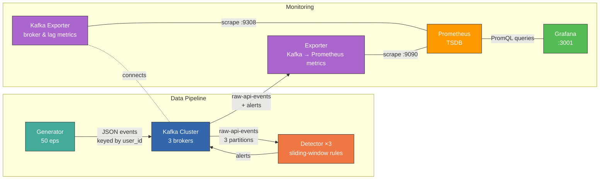

# DR Platform

Real-time Claude API abuse detection platform — streaming telemetry through Kafka into a rule-based detection engine.

## System Diagram



## Data flow

Events are keyed by `user_id`, so a user's events always land on the same Kafka partition — keeping per-user sliding windows consistent across the 3 detector replicas.

## Prerequisites

- Python 3.12+
- Docker Desktop (with `docker compose` plugin)
- macOS: Homebrew (for `librdkafka`)
- Linux: `apt-get` or `dnf` (for `librdkafka-dev`)

## Setup

```bash
chmod +x setup.sh && ./setup.sh
```

The setup script will:
1. Create a `.venv` virtual environment (if it doesn't exist)
2. Install system dependencies (`librdkafka` via Homebrew/apt/dnf)
3. Install pinned Python packages from `requirements-dev.txt`
4. Pull all required Docker images
5. Install `kcat` (optional Kafka CLI tool)

## Dependency management

| File | Purpose |
|---|---|
| `pyproject.toml` | Canonical dependency spec with version ranges |
| `requirements.txt` | Pinned runtime deps (used by Dockerfile) |
| `requirements-dev.txt` | Runtime + test deps (used by setup.sh) |

To add a new dependency: add it to `pyproject.toml`, install it, then regenerate the pinned files with `pip freeze`.

## Run (Docker)

```bash
docker compose -f docker/docker-compose.yml up -d --build
```

Starts the full stack (14 containers): ZooKeeper, 3 Kafka brokers, Kafka UI, generator, 3 detector replicas, metrics exporter, kafka-exporter, Prometheus, and Grafana.

## Run tests

```bash
source .venv/bin/activate
pytest detector/tests/ -v
```

## Run locally (without Docker)

Start Kafka however you like, then in separate terminals:

```bash
source .venv/bin/activate

# Terminal 1: generator
python -m generator.main --bootstrap-servers localhost:9092 --eps 50

# Terminal 2: detector
python -m detector.main --bootstrap-servers localhost:9092
```

## Dashboards

After `docker compose up`, open **Grafana** at [http://localhost:3001](http://localhost:3001) (anonymous access enabled, no login required). Navigate to **Dashboards → Detection & Response** folder.

**Infrastructure Health** — "Is the pipeline healthy right now?"
- Pipeline throughput, Kafka broker count, consumer lag (total + per-partition)
- Kafka topic throughput, request latency percentiles (p50/p95/p99), token volume

**Detection & Threat Analysis** — "Who's being bad, how, and is it getting worse?"
- Alert rate by severity and rule, unique offenders, safety trigger patterns
- Top users by alert count vs. event volume (cross-reference to distinguish abusers from power users)
- Rate-limit/request ratio (leading indicator), input token distribution heatmap (abuse fingerprint)

Each panel has a tooltip (hover the `i` icon) explaining what to look for.

## Verify

- Container health: `docker compose -f docker/docker-compose.yml ps`
- Kafka UI: [http://localhost:8080](http://localhost:8080)
- Grafana: [http://localhost:3001](http://localhost:3001)
- Prometheus: [http://localhost:9091](http://localhost:9091)
- Generator logs: `docker compose -f docker/docker-compose.yml logs -f generator`
- Detector logs / alerts: `docker compose -f docker/docker-compose.yml logs -f detector`

## See it in action

After `docker compose up`, the generator starts producing events at 50/sec with a mix of normal users and three attacker profiles baked in. The detector picks these up and fires alerts as abuse thresholds are crossed.

**1. Watch alerts fire in real time:**

```bash
docker compose -f docker/docker-compose.yml logs -f detector 2>&1 | grep ALERT
```

You should see output like:

```
ALERT  rule=rate_abuse           severity=high     user=user_0009  events=62
ALERT  rule=prompt_injection     severity=critical  user=user_0010  events=5
ALERT  rule=token_abuse          severity=high     user=user_0011  events=6
```

Rate abuse fires first (~60s), then prompt injection (~minutes), then token abuse (~15min).

**2. Inspect topics in Kafka UI:**

Open [http://localhost:8080](http://localhost:8080) and check:
- `raw-api-events` — events flowing in across 3 partitions
- `alerts` — alert payloads produced by the detector, keyed by `user_id`

**3. Read raw alert payloads from the CLI:**

```bash
docker compose -f docker/docker-compose.yml exec kafka-1 \
  kafka-console-consumer --bootstrap-server localhost:9092 \
  --topic alerts --from-beginning
```

Each alert is a JSON object with `rule_id`, `severity`, `user_id`, `event_count`, and `window_seconds`.

## Stop

```bash
docker compose -f docker/docker-compose.yml down
```

Add `-v` to wipe all Kafka/ZooKeeper data for a clean restart.
